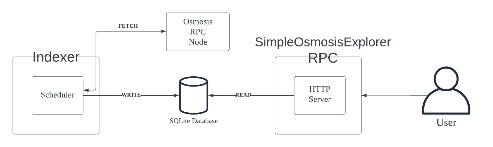

# Overview
SimpleOsmosisIndexer indexes the latest block of Osmosis chain every 2 seconds, and stores the information on sqlite sql database.

It also has an HTTP server that can handle the following logic.

- Which blocks validator X has proposed
- How many transactions were made in the last N blocks
- Top N peers based on score over the last N blocks

The [rpc/simple_osmosis_explorer.proto](rpc/simple_osmosis_explorer.proto) file defines the RPC, and it is translated into different http methods, requests, and responses by [Twirp](https://twitchtv.github.io/twirp/docs/intro.html).

## Architecture

## Demo
https://github.com/seungjulee/hashi/assets/4685781/fcc6b562-13b4-489d-8bcd-cd382dd2c83e

## Prerequisite
1. sqlite
2. [Twirp](https://twitchtv.github.io/twirp/docs/intro.html) Twirp is a simple RPC framework built on protobuf. You define a service in a .proto specification file, then Twirp will generate servers and clients for that service.
3. protobuf - For installation instructions, see Protocol [Buffer Compiler Installation](https://grpc.io/docs/protoc-installation/) (For example in MacOS: `brew install protobuf`).

## Running it locally

1. Run indexer by `make run_indexer`
2. Run http server by `make run_server`
3. Send a http request like specified on `make run_example_get_number_of_txs_in_last_n_blocks`

## Development

## Indexer
- When creating a new table, update the automigration on [pkg/datastore/sqlite.go](.pkg/datastore/sqlite.go:29)
- To add a new method, update [pkg/datastore/datastore.go](.pkg/datastore/datastore.go) interface first

## RPC / API Server
When adding a new method, do the following
1. Update [rpc/simple_osmosis_explorer.proto](rpc/simple_osmosis_explorer.proto)
2. Run `make gen`. This creates a http compliant rpc interface.
3. On [internal/server/server.go](./internal/server/server.go), implement the new method as specified on the `SimpleOsmosisExplorer` interface at [rpc/simple_osmosis_explorer.twirp.go](./rpc/simple_osmosis_explorer.twirp.go).

For more Info, please visit https://twitchtv.github.io/twirp/


## TODO
### Infra
1. Use Websocket to subscribe to new blocks and transactions
2. If any block height is missing, fetch and index the missing block
3. Add a way to backfill the data
4. Load config instead of hard-coded config

### Feature
1. Separate out the schema for transaction. Include more properties
2. Better scoring system for net info. Look into https://github.com/nervosnetwork/rfcs/blob/master/rfcs/0007-scoring-system-and-network-security/0007-scoring-system-and-network-security.md https://github.com/bro-n-bro/bro_rating/blob/main/README.md


## Example Query
```sh
curl --request "POST" \
    --header "Content-Type: application/json" \
    --data '{"address": "1F7249F418B90714BF52797336B771B5AD467533"}' \
    http://localhost:8080/twirp/rpc.SimpleOsmosisExplorer/GetBlocksByProposer
{"blocks":[{"block_id":"", "hash":"23C9F0C97350B5F241668872F38745D98155733D27AC0B80A71709D2FA987F13", "height":"10724728", "proposer_address":"1F7249F418B90714BF52797336B771B5AD467533", "time":"2023-07-27T15:51:11.958921266Z", "txs":"", "num_txs":"5"}, {"block_id":"", "hash":"572A957F3278993389D88510716FD60D0D6DCC6502AFD1F695AE24242014E00B", "height":"10729497", "proposer_address":"1F7249F418B90714BF52797336B771B5AD467533", "time":"2023-07-27T23:36:34.619825918Z", "txs":"", "num_txs":"5"}, {"block_id":"", "hash":"3C02747AA005AE5DC61056BF8BA087BDE6947C34674AB90E09D723F13BAFB49C", "height":"10729509", "proposer_address":"1F7249F418B90714BF52797336B771B5AD467533", "time":"2023-07-27T23:37:41.553167740Z", "txs":"", "num_txs":"2"}, {"block_id":"", "hash":"B23617DCBA21AB7CAED0184EFA10C7347FADAC065DEB8151370FFCDC4FBC7C47", "height":"10729775", "proposer_address":"1F7249F418B90714BF52797336B771B5AD467533", "time":"2023-07-28T00:03:04.764905669Z", "txs":"", "num_txs":"14"}, {"block_id":"", "hash":"86D32433BD8E72AD7F879A6C8E43E5158AE93B4EA99E7BF4184AF44FD0422F1A", "height":"10729788", "proposer_address":"1F7249F418B90714BF52797336B771B5AD467533", "time":"2023-07-28T00:04:12.821437558Z", "txs":"", "num_txs":"4"}, {"block_id":"", "hash":"2F007563B3F906150D81196659AA6696D996B27BC6000E3CFACE325F2EF33AB5", "height":"10729801", "proposer_address":"1F7249F418B90714BF52797336B771B5AD467533", "time":"2023-07-28T00:05:28.097258519Z", "txs":"", "num_txs":"4"}, {"block_id":"", "hash":"C67170548366E87D7E9E18093459A9D13C2E0B16486647E6F1B5F868A91D3BFF", "height":"10729813", "proposer_address":"1F7249F418B90714BF52797336B771B5AD467533", "time":"2023-07-28T00:06:39.653323069Z", "txs":"", "num_txs":"3"}, {"block_id":"", "hash":"86ACB6ACF5B70B584D3502AA39D6111AC358CC7814BAC9F5FE759EF56E083F80", "height":"10729826", "proposer_address":"1F7249F418B90714BF52797336B771B5AD467533", "time":"2023-07-28T00:07:58.084622479Z", "txs":"", "num_txs":"2"}, {"block_id":"", "hash":"383F6CF4AC280AC4C1E3DB073B6977FD15B5D374AFA97F369614D01F0A25DC2D", "height":"10729838", "proposer_address":"1F7249F418B90714BF52797336B771B5AD467533", "time":"2023-07-28T00:09:06.665358510Z", "txs":"", "num_txs":"0"}, {"block_id":"", "hash":"0CF1965B90CEACFD140CEAC5C98360CBD9823EE8AA7746139BBCA1A68DA00F56", "height":"10730712", "proposer_address":"1F7249F418B90714BF52797336B771B5AD467533", "time":"2023-07-28T01:32:28.081815983Z", "txs":"", "num_txs":"3"}]}%
```

```sh
curl --request "POST" \
    --header "Content-Type: application/json" \
    --data '{"n": 4}' \
    http://localhost:8080/twirp/rpc.SimpleOsmosisExplorer/GetNumberOfTXsInLastNBlocks
{"total_num_txs":"14", "blocks":[{"block_id":"", "hash":"648CF98E9D110D581F5505780D2A5F7D0F8D22947D10CFB46609AFDC9874588E", "height":"10730715", "proposer_address":"AF195943E44FE1D6250076B8BC1910EABC85F1F2", "time":"2023-07-28T01:32:46.366275860Z", "txs":"", "num_txs":"2"}, {"block_id":"", "hash":"97EF7A48D20120279DF00FDD2486AFE01EAAF81048324075D1090E7EB9DCCFB9", "height":"10730714", "proposer_address":"99063B919404B6950A79A6A31E370378FE07020D", "time":"2023-07-28T01:32:40.450133150Z", "txs":"", "num_txs":"6"}, {"block_id":"", "hash":"30EB532A951A260AE3C287F5E082F1FD8E5CFF74DF7055E2CA29C46F2B5EE9B4", "height":"10730713", "proposer_address":"16A169951A878247DBE258FDDC71638F6606D156", "time":"2023-07-28T01:32:34.520654391Z", "txs":"", "num_txs":"3"}, {"block_id":"", "hash":"0CF1965B90CEACFD140CEAC5C98360CBD9823EE8AA7746139BBCA1A68DA00F56", "height":"10730712", "proposer_address":"1F7249F418B90714BF52797336B771B5AD467533", "time":"2023-07-28T01:32:28.081815983Z", "txs":"", "num_txs":"3"}]}
```

```sh
 curl --request "POST" \
    --header "Content-Type: application/json" \
    --data '{"n_peer": 3, "n_block": 3}' \
    http://localhost:8080/twirp/rpc.SimpleOsmosisExplorer/GetTopNPeersByScoreInLastNBlocks


{"top_n_peers_by_block_height":{"10730901":{"peers":[{"block_height":"10730901", "remote_ip":"135.181.138.95", "default_node_id":"3918d0e114ce819644e966141a5f5229d4248da8", "score":"100"}, {"block_height":"10730901", "remote_ip":"128.0.51.4", "default_node_id":"94a5f37693ba36617029a47d654460d161678af6", "score":"100"}, {"block_height":"10730901", "remote_ip":"65.108.201.138", "default_node_id":"8e1cf1149a5c16ad1733db8921581be99ddb7602", "score":"100"}]}, "10730902":{"peers":[{"block_height":"10730902", "remote_ip":"15.204.52.75", "default_node_id":"7f36123a395e902deaecf63bdaf5656bbb209623", "score":"93"}, {"block_height":"10730902", "remote_ip":"142.132.248.253", "default_node_id":"08ceabce6dadc0aa5d33dc2058b9eeeff6186116", "score":"92"}, {"block_height":"10730902", "remote_ip":"78.46.69.29", "default_node_id":"b69e57cd6f796ac5d6efb1a834163365c37cbfa8", "score":"88"}]}, "10730903":{"peers":[{"block_height":"10730903", "remote_ip":"35.213.129.89", "default_node_id":"834d65bab50dc073c61fa111b418799e51a88fc7", "score":"92"}, {"block_height":"10730903", "remote_ip":"202.182.125.232", "default_node_id":"ed49ce10d8787011c03883846f5cccfcf184e3dc", "score":"91"}, {"block_height":"10730903", "remote_ip":"74.118.140.23", "default_node_id":"82e224c9640048a6513c589e904c0d903bb99f32", "score":"90"}]}}}%
```